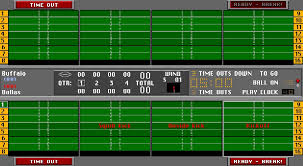
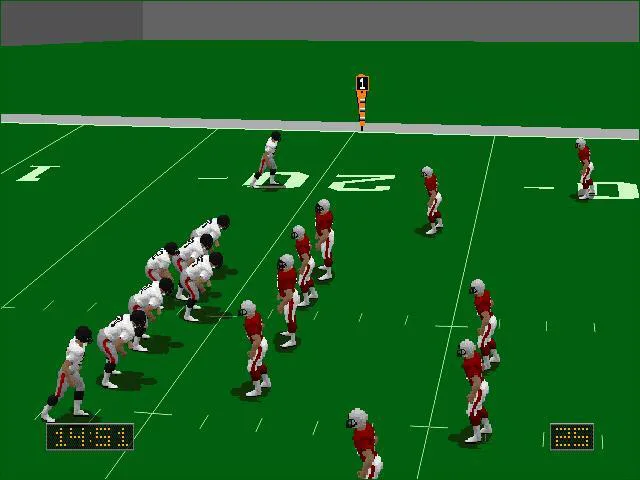

# Front Page Sports: Football Pro '93 (Recreation)

A faithful modern recreation of the classic Sierra game from 1993, built with Swift and SwiftUI for macOS. This project aims to bring back the authentic experience of *Front Page Sports: Football Pro '93*, complete with its iconic overhead field view, complex simulation engine, and retro aesthetic.



## Overview

This project is a native macOS application that recreates the gameplay, visuals, and management depth of the original game. It features a fully functional simulation engine, an 8-team league structure (expandable), and the classic "X's and O's" visual style that fans remember.

## Key Features

### 🎮 Authentic Visuals
- **FPS '93 Style Field View**: The overhead field view has been meticulously recreated with green turf, horizontal yard lines, hash marks, and end zones shaded to match the original.
- **Player Sprites**: Authentic red (home) and white (away) player dots with jersey numbers.
- **Classic Splash Screen**: The iconic sunset stadium opening screen has been recreated with modern rendering techniques.
- **Retro UI**: Clean, simple graphics and burgundy panels reminiscent of the DOS era.

### 🏈 Deep Simulation
- **Physics-Based Gameplay**: Real-time physics calculations for parabolic pass trajectories, player acceleration, and collision detection.
- **Full NFL Rules**: Includes correct implementation of kickoffs, punts, touchbacks (25-yard line rule), clock management, and penalties.
- **Complex Stats**: Tracks passing, rushing, receiving, and defensive stats for every player.
- **AI Coach**: CPU makes situational play-calling decisions based on game state.

### 📋 Team Management
- **Roster Management**: Full 53-man rosters with depth charts for all positions.
- **Player Ratings**: 30+ attributes per player on a 1-99 scale.
- **Season Mode**: 14-game regular season with playoffs (Semifinals & Championship).
- **Draft & Trading**: NFL-style draft with scouting and trade logic.

### 🔊 Retro Audio
- **Synthesized Sound Effects**: Classic square-wave and chip-tune style sound effects for tackles, catches, and scoring.
- **Crowd Noise**: Dynamic crowd reactions based on game events.

## Screenshots

The `screenshots/` directory contains references used for this recreation.

| Original Inspiration | Recreation |
|----------------------|------------|
|  | *See `footballPro` app in action!* |

## Installation & Running

### Requirements
- macOS 14.0 (Sonoma) or later
- Xcode 15.0 or later (for building from source)
- Swift 5.9+

### From Source (Xcode)
1. Clone the repository:
   ```bash
   git clone https://github.com/yourusername/footballPro.git
   cd footballPro
   ```
2. Open the project:
   ```bash
   open footballPro/footballPro.xcodeproj
   ```
3. Build and run (⌘R).

### From Command Line (Swift Package Manager)
1. Navigate to the project directory:
   ```bash
   cd footballPro
   ```
2. Build and run:
   ```bash
   swift build
   swift run
   ```

## Controls

The game supports keyboard/mouse, as well as Xbox, PlayStation, and Nintendo controllers.

### Keyboard Controls

**General Navigation**
- **Navigate**: Arrow Keys / WASD
- **Select/Confirm**: Enter / Space
- **Back/Cancel**: Escape
- **Tab Control**: Q/E or [/]

**Game Day**
- **Call Timeout**: T
- **View Play Info**: I
- **Toggle Sim Speed**: 1-4
- **Skip to End of Quarter**: End
- **Quick Save**: ⌘S

### Controller Support
Connect your controller via Bluetooth or USB. The game automatically detects the controller type and updates button prompts.
- **Xbox**: A to Select, B to Back, Y for Info
- **PlayStation**: X to Select, O to Back, Triangle for Info
- **Nintendo**: A to Select, B to Back, X for Info

## Project Structure

```
footballPro/
├── footballPro/
│   ├── App/                  # App entry point
│   ├── Models/               # Core data models (Player, Team, Game, Season)
│   ├── Engine/               # Simulation logic (Physics, AI, Rules)
│   ├── ViewModels/           # State management
│   ├── Views/                # SwiftUI views
│   │   ├── Game/             # Game day views (Field, Scoreboard)
│   │   └── ...
│   ├── Input/                # Controller & Keyboard handling
│   └── Resources/            # Data files (Playbooks, Teams)
├── Tests/                    # Unit tests
└── footballPro.xcodeproj     # Xcode project file
```

## Current Status

The project has achieved "Complete Recreation" status for the core gameplay loop:
- ✅ **Opening Kickoff**: Fully implemented with returns and touchbacks.
- ✅ **Field View**: Authentic overhead view with animations.
- ✅ **Rules**: Major football rules (turnovers, clock, penalties) are fixed.
- ✅ **Build**: Builds successfully via Xcode and SPM.

See `STATUS.md` and `FPS93_RECREATION_COMPLETE.md` for detailed progress reports.

## License

This project is licensed under the MIT License.

## Acknowledgments

- Inspired by **Front Page Sports: Football Pro** (Sierra, 1993).
- Built as a tribute to the classic simulation that defined a genre.
- Uses Apple's GameController framework for modern input support.
